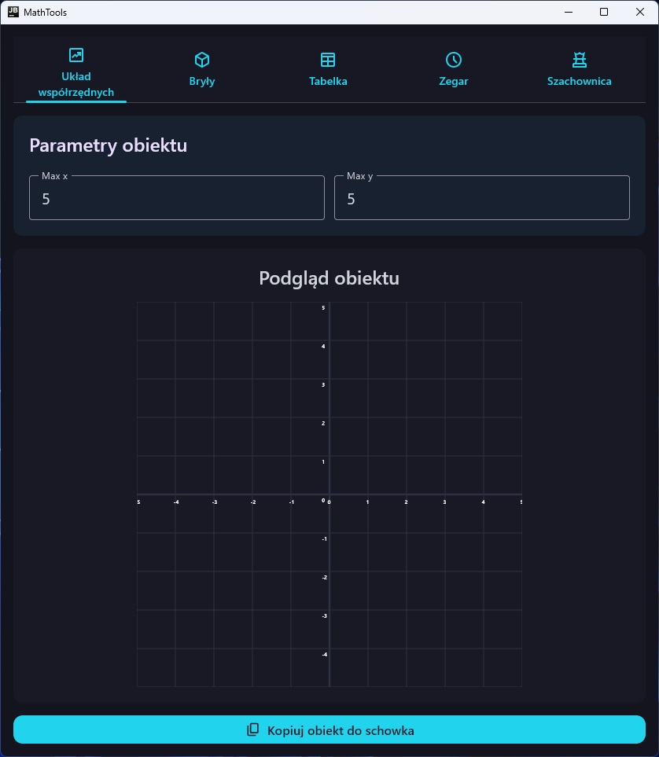
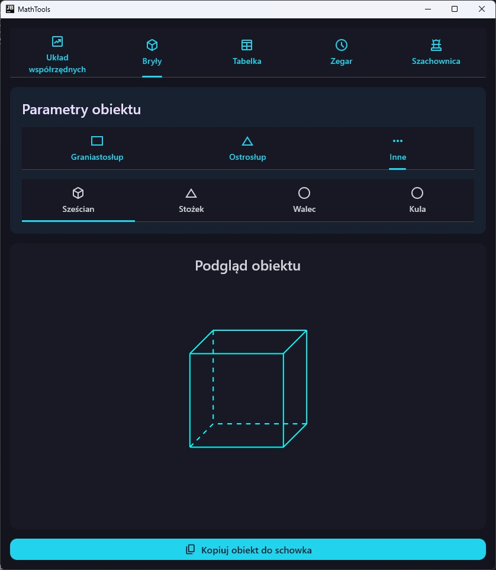
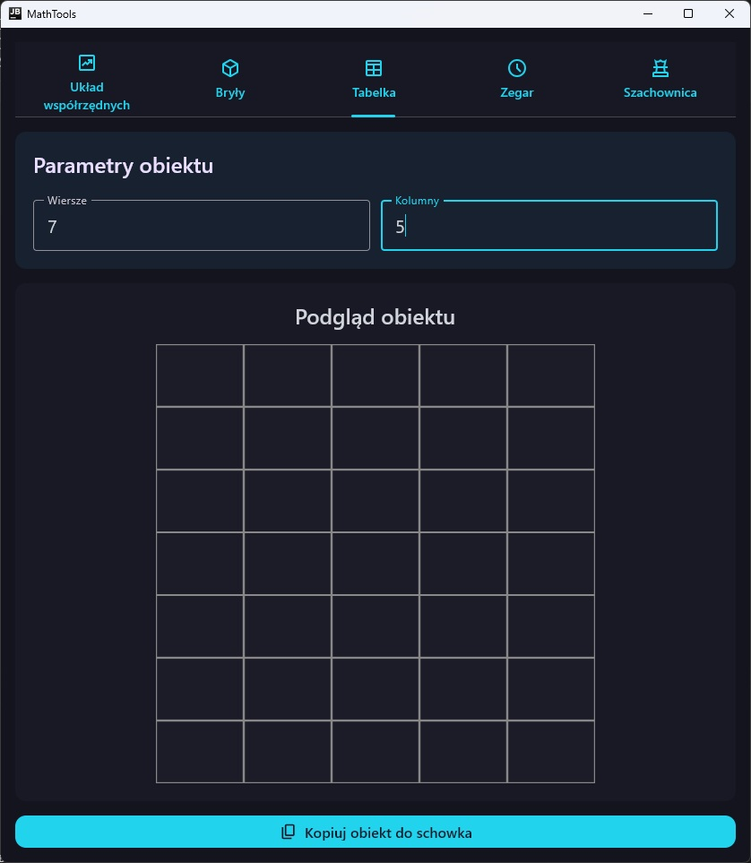
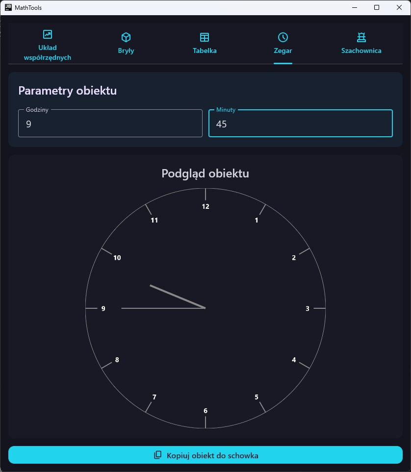
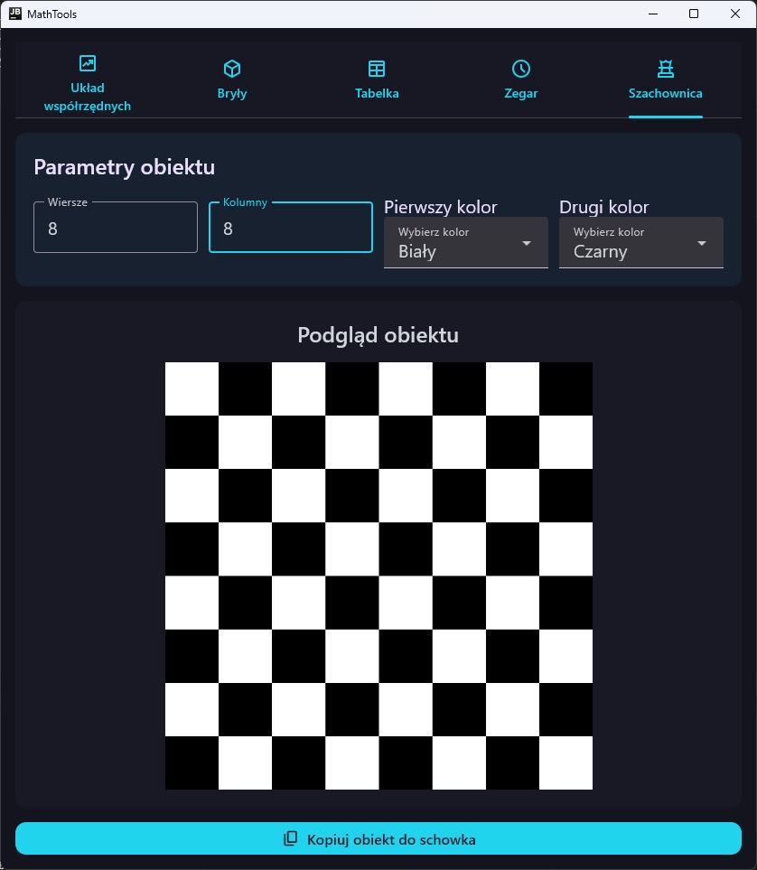

# 📦 Math Tools

> **A desktop application for necessary drawings at math tutoring**

---

## 🌟 Features
- Generation of coordinate system with specified X and Y ranges
- Generation of table with specified count of rows and columns
- Generation of chessboard with specified count of rows and columns, and colors
- Generation of prism with specified count of sides
- Generation of pyramid with specified count of sides
- Generation of roller, cone, cube, sphere
- Copying drawing with transparent background to clipboard allowing to paste them in any tool that lets you draw

---

## ℹ️ Overview

I am a math tutor, and this application was created to save time during the tutoring sessions and improve drawings quality.

---

## 🛠️ Tech Stack

- **Kotlin Multiplatform** – for cross-platform development
- **Compose Multiplatform** – for building the UI
---

## 📷 Screenshots

---
