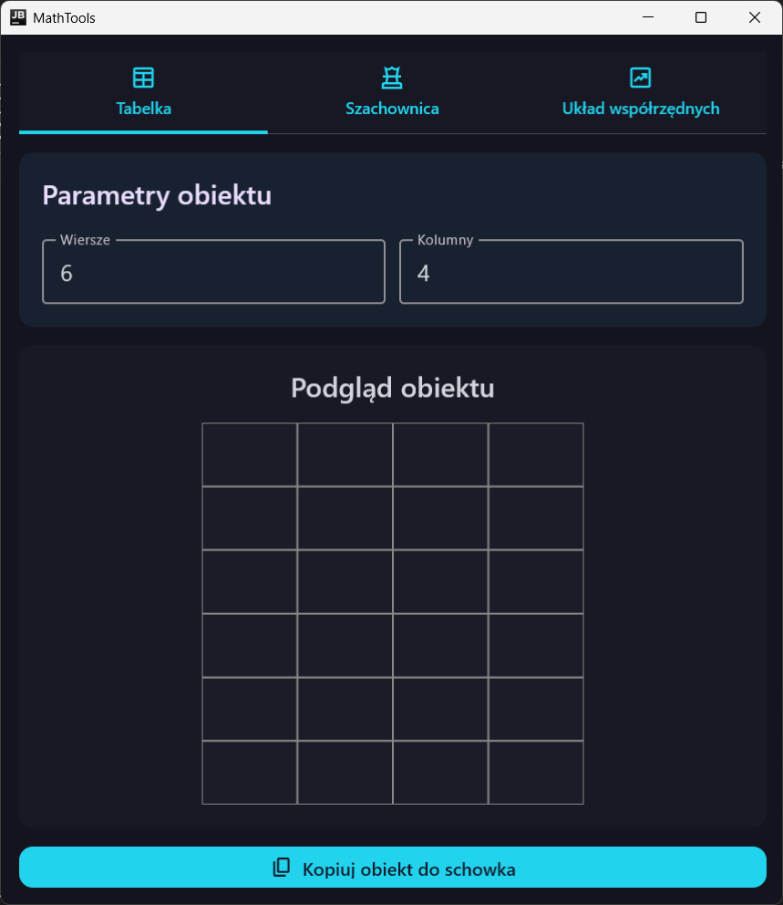

# 📦 Math Tools

> **A desktop application for drawing usefull thing during math tutoring sessions**

---

## 🌟 Features

- 🔢 Generation of table with specified count of rows and columns
- ✍️ Generation of chessboard with specified count of rows and columns, and colors
- 📘 Generation of coordinate system with specified X and Y ranges 
- 📊 Copying drawing with transparent background to clipboard allowing to paste them in any tool that lets you draw

---

## ℹ️ Overview

I am a math tutor, and this application was created to save time during the tutoring sessions and also draw with higher accuracy.

---

## 🛠️ Tech Stack

- **Kotlin Multiplatform** – for cross-platform development
- **Compose Multiplatform** – for building the UI
---

## 📷 Screenshots

---

## 📄 License
© All rights reserved.
This project was created for educational purposes and will also be used as part of the DayMath commercial application.
